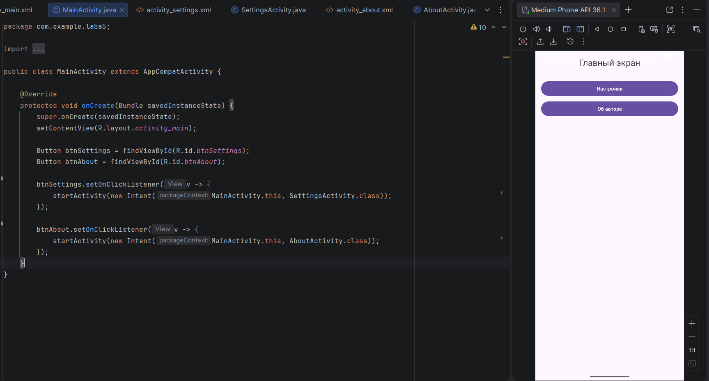
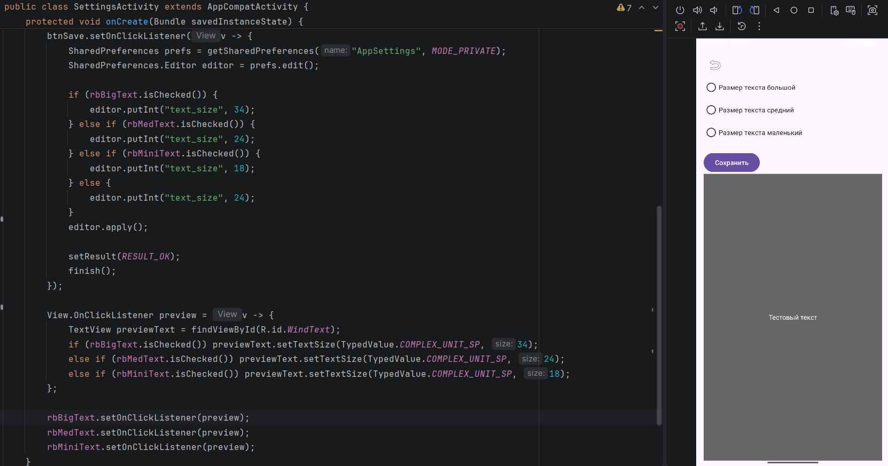
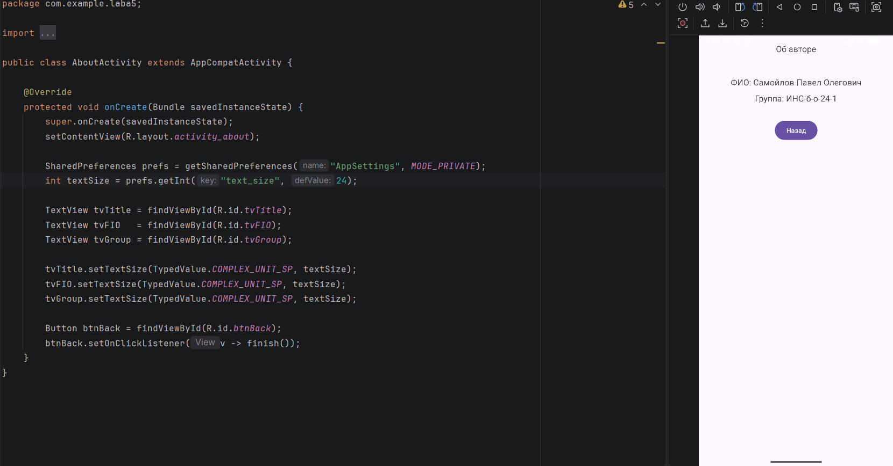

# Отчет

## Практическая работа №5

## Работа с несколькими окнами (Activity)

**Выполнил:**  
Самойлов Павел Олегович

**Курс:**
2 
**Группа:** ИНС-б-о-24-1

**Направление:** 09.03.02

**Профиль:** Информационные системы и технологии

### Цель работы

Научиться создавать многоэкранные приложения, осуществлять навигацию между активностями (Activity) и передавать данные между ними с использованием объектов Intent и механизма startActivityForResult / onActivityResult.

### Ход работы
Поставновка индвидуального задания: Изменение размера текста на главной странице (маленький, средний, большой).

Реализация главного окна прилжения. Добавление кнопок навигации "Настройки" и "Об авторе" 

*Рисунок 1. Создание главного окна приложения*

Реализация главного окна прилжения. Добавление кнопок настроек: большой текст, средний текст, маленький текст.

*Рисунок 2. Вид окна настроек*

Вид окна Об авторе содержащий в себе текст реагирующий на выбрнный пунк в окне настроек.

*Рисунок 3. Вид окна настроек*

### Вывод
В результате выполнения практической работы я научился создавать многоэкранные приложения, осуществлять навигацию между активностями (Activity) и передавать данные между ними с использованием объектов Intent и механизма startActivityForResult / onActivityResult..

### Ответы на контрольные вопросы
**Вопрос 1:** Что такое Intent? Какие существуют типы Intent (явные и неявные)? Приведите примеры использования каждого типа.

Явный Intent (Explicit Intent) — точно указывает, какой компонент (класс) следует запустить. Используется для навигации внутри собственного приложения.

  
  Intent intent = new Intent(MainActivity.this, SecondActivity.class);
  startActivity(intent);
  

Неявный Intent (Implicit Intent) — описывает действие, которое нужно выполнить (например, открыть веб-страницу, позвонить), и система сама находит подходящее приложение для его выполнения.

  Intent intent = new Intent(Intent.ACTION_VIEW, Uri.parse("https://google.com"));
  startActivity(intent);
  

**Вопрос 2:** Как передать данные из одной Activity в другую с помощью Intent? Какие ограничения на типы передаваемых данных существуют?

Для передачи данных используется метод putExtra() объекта Intent. Данные хранятся в виде пар "ключ-значение".

Максимальный размер всех extras вместе ≈ 1 МБ

**Вопрос 3:** В чем разница между методами startActivity() и startActivityForResult()? В каких случаях используется каждый из них?

Метод startActivity(Intent intent): Запускает новую Activity без ожидания какого-либо результата от неё.
Когда используется:
Для простого перехода между экранами.
Когда не нужно получать никаких данных обратно.

Метод startActivityForResult(Intent intent, int requestCode): Запускает новую Activity и ожидает от неё результат.
Когда используется:
Когда вторая Activity должна вернуть какие-то данные в первую.
Для получения результата выбора пользователя.

**Вопрос 4:** Опишите назначение методов setResult() и finish() в контексте возврата данных из дочерней Activity.

Метод setResult() - Устанавливает результат работы дочерней Activity, который будет передан обратно в родительскую Activity.

Метод finish() - Закрывает текущую (дочернюю) Activity и возвращает управление обратно в родительскую Activity.

**Вопрос 5:**  Что произойдёт, если не зарегистрировать Activity в файле AndroidManifest.xml?

Если Activity не объявлена в AndroidManifest.xml, то при попытке её запуска приложение упадёт с ошибкой.

**Вопрос 6:** Какие методы жизненного цикла Activity вызываются при переходе от MainActivity к SettingsActivity и при возврате обратно?

При переходе из MainActivity в SettingsActivity
Когда пользователь нажимает кнопку и запускается новая Activity, методы жизненного цикла вызываются в следующем порядке:
В MainActivity (родительская):

1. onPause() — MainActivity теряет фокус
  
В SettingsActivity (дочерняя):
2. onCreate() — создание Activity

3. onStart() — становится видимой
   
4. onResume() — получает фокус и становится активной (пользователь может взаимодействовать)
   
После этого MainActivity продолжает:

5. onStop() — MainActivity больше не видна на экране

При возврате из SettingsActivity обратно в MainActivity
Когда в SettingsActivity вызывается finish(), порядок вызовов следующий:

В SettingsActivity (закрывается):

onPause() — теряет фокус

onStop() — больше не видна

onDestroy() — уничтожается (если не используется повторно)

В MainActivity (возвращается на передний план):

onRestart() — вызывается перед onStart(), когда Activity возобновляется после остановки

onStart() — снова становится видимой

onResume() — получает фокус и становится активной

**Вопрос 7** Для чего используется requestCode в методе startActivityForResult()? Как обрабатываются несколько различных запросов в onActivityResult()?

requestCode — это уникальный идентификатор запроса, который разработчик сам присваивает при запуске Activity с помощью метода startActivityForResult().

Основные цели requestCode:

Отличать разные запросы друг от друга, gпнимать, от какой именно Activity пришёл результат, обрабатывать несколько одновременных запросов в одном методе onActivityResult().

Пример обработки нескольких запросов:

<dev>
  
    private static final int REQUEST_CODE_SETTINGS = 101;
    private static final int REQUEST_CODE_CHOOSE_PHOTO = 102;
    private static final int REQUEST_CODE_SELECT_CONTACT = 103;
    
    @Override
    protected void onActivityResult(int requestCode, int resultCode, @Nullable Intent data) {
        super.onActivityResult(requestCode, resultCode, data);
    
        if (resultCode == RESULT_OK && data != null) {
    
            switch (requestCode) {
    
                case REQUEST_CODE_SETTINGS:
                    // Пришёл результат из окна Настроек
                    int textSize = data.getIntExtra("text_size", 24);
                    applyTextSize(textSize);
                    break;
    
                case REQUEST_CODE_CHOOSE_PHOTO:
                    // Пришло выбранное фото
                    Uri photoUri = data.getData();
                    loadPhoto(photoUri);
                    break;
    
                case REQUEST_CODE_SELECT_CONTACT:
                    // Пришёл выбранный контакт
                    String contactName = data.getStringExtra("contact_name");
                    addContact(contactName);
                    break;
    
                default:
                    // Неизвестный requestCode
                    break;
            }
        }
    }

</dev>
